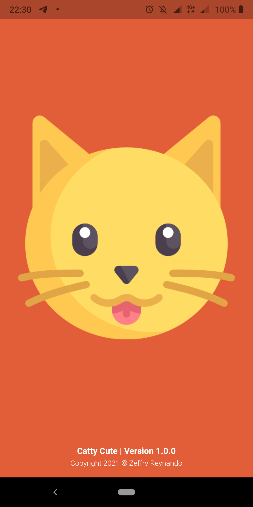
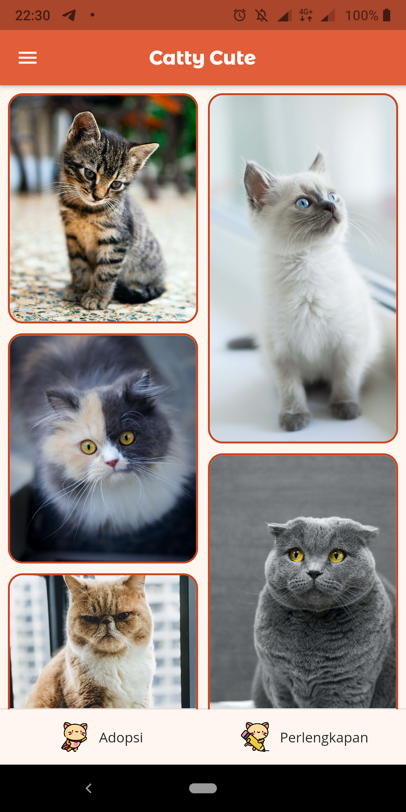
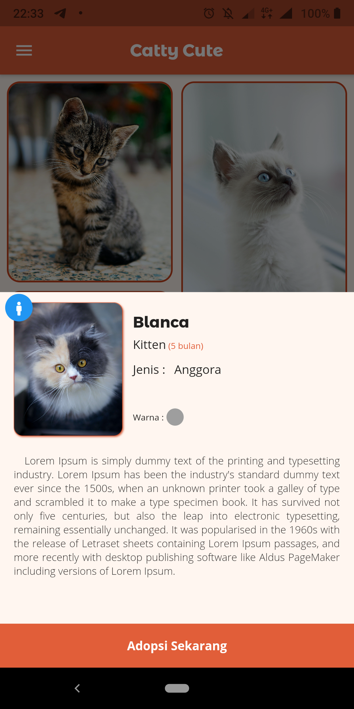
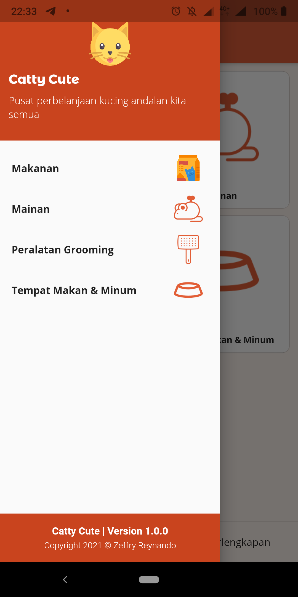
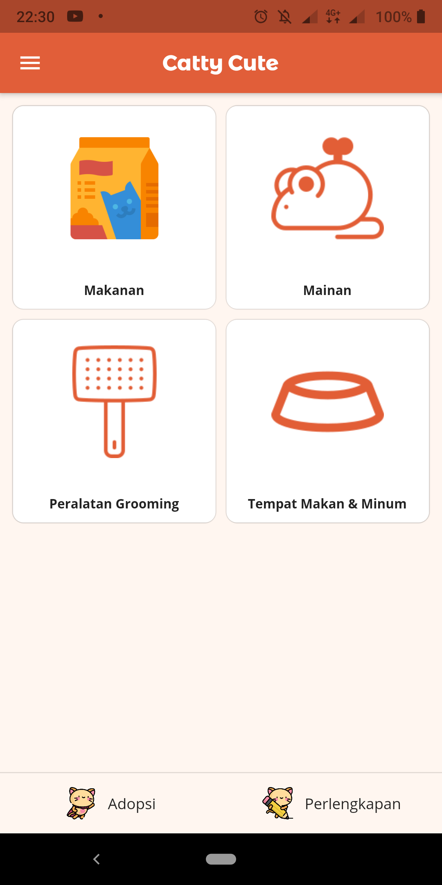
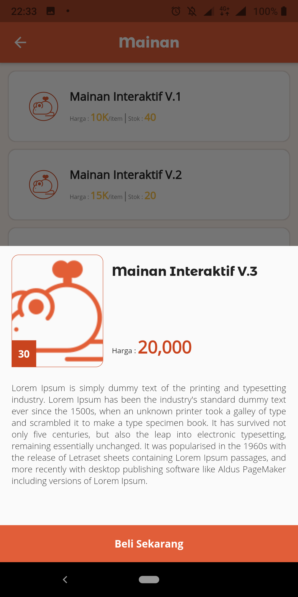

# Proyek Akhir Kelas Belajar Flutter Untuk Pemula

## Preview Application

<table>
  <tr align="center">
    <!-- <td>Onboarding Screen</td>
    <td>Most played song</td>
    <td>List recently played song</td> -->
  </tr>
  <tr>
    <td></td>
    <td></td>
    <td></td>
  </tr>
   <tr align="center">
    <!-- <td>List of musics</td>
    <td>Detail Music</td>
    <td>Share to Instagram</td> -->
  </tr>
  <tr>
    <td></td>
    <td></td>
    <td></td>
  </tr>
  <tr align="center">
    <!-- <td>Info Application</td>
    <td>Sort By Feature</td> -->
  </tr>
 </table>